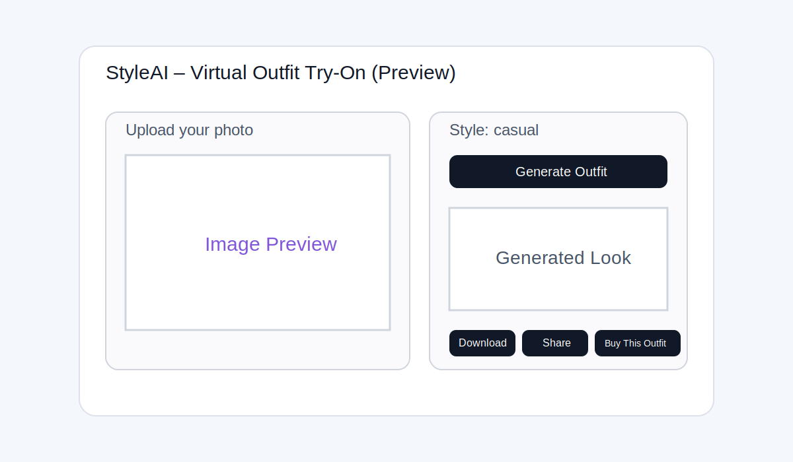

# StyleAI – Virtual Outfit Try-On App

StyleAI is a full-stack AI fashion app where users upload a photo and generate outfit previews in different styles (casual, formal, party, celebrity-inspired).

## Features

## UI Preview



- Upload and preview user image
- Choose outfit style from dropdown
- AI outfit generation via **Replicate / Stable Diffusion**
- Automatic fallback local preview (for local runs without API key)
- Download generated image
- Share via native share or WhatsApp link
- Buy This Outfit button with affiliate links
- FastAPI backend with CORS configured
- Optional MongoDB storage for generation history
- Retry support and robust error handling
- Mobile responsive UI

## Project Structure

```text
styleai/
├── assets/
│   └── styleai-preview.svg
├── backend/
│   ├── main.py
│   ├── config.py
│   ├── models.py
│   ├── requirements.txt
│   ├── .env.example
│   ├── data/
│   │   ├── uploads/
│   │   └── generated/
│   └── services/
│       ├── ai.py
│       └── storage.py
├── frontend/
│   ├── package.json
│   ├── README.md
│   ├── vite.config.js
│   ├── .env.example
│   ├── index.html
│   └── src/
│       ├── main.jsx
│       ├── App.jsx
│       ├── styles.css
│       ├── constants.js
│       ├── hooks/useOutfitGenerator.js
│       ├── services/outfitApi.js
│       ├── utils/share.js
│       └── components/
│           ├── ActionButtons.jsx
│           ├── ErrorBanner.jsx
│           ├── ImageUploader.jsx
│           ├── LoadingSpinner.jsx
│           ├── ResultSection.jsx
│           └── StyleSelector.jsx
└── README.md
```

---

## Local Installation

### 1) Backend (FastAPI)

```bash
cd styleai/backend
python -m venv .venv
source .venv/bin/activate  # Windows: .venv\Scripts\activate
pip install -r requirements.txt
cp .env.example .env
```

Update `.env`:
- `BASE_URL=http://localhost:8000`
- `CORS_ORIGINS=http://localhost:5173`
- Add `REPLICATE_API_TOKEN` for real AI generation.

Run backend:

```bash
uvicorn main:app --reload --port 8000
```

### 2) Frontend (React + Vite)

```bash
cd styleai/frontend
npm install
cp .env.example .env
npm run dev
```

App runs at `http://localhost:5173`.

---

## API Contract

### POST `/generate-outfit`

**Form-data input:**
- `image` (file: jpg/png/webp)
- `style` (string: casual | formal | party | celebrity-inspired)

**Response:**

```json
{
  "generated_image_url": "http://localhost:8000/generated/generated_abc123.jpg",
  "style": "casual",
  "affiliate_url": "https://www.amazon.com/s?k=casual+fashion&tag=styleai-20",
  "message": "Generated by Replicate model."
}
```

---

## Prompt Engineering

Defined in `backend/services/ai.py`:
- Casual: `person wearing casual modern outfit ...`
- Formal: `person wearing business formal suit ...`
- Party: `person wearing party wear stylish outfit ...`
- Celebrity-inspired: `person in a celebrity-inspired luxury outfit ...`

---

## Optional Database (MongoDB)

Enable by setting:

```env
USE_MONGODB=true
MONGODB_URI=mongodb://localhost:27017
MONGODB_DB_NAME=styleai
```

This stores generation metadata (style, upload URL, generated URL, timestamp).

---

## Deployment

### Frontend → Vercel
1. Push repository to GitHub.
2. Import `styleai/frontend` as a Vercel project.
3. Set environment variable:
   - `VITE_API_BASE_URL=https://<your-render-backend>.onrender.com`
4. Build command: `npm run build`
5. Output directory: `dist`

### Backend → Render
1. Create new **Web Service** from this repository.
2. Root directory: `styleai/backend`
3. Build command:
   ```bash
   pip install -r requirements.txt
   ```
4. Start command:
   ```bash
   uvicorn main:app --host 0.0.0.0 --port $PORT
   ```
5. Add env vars from `.env.example` (`BASE_URL`, `CORS_ORIGINS`, optional Replicate/MongoDB values).

CORS is already handled with `CORS_ORIGINS` in backend config.

---

## Monetization (Affiliate)

The "Buy This Outfit" button uses style-based affiliate links returned by backend.
Replace the sample Amazon links/tags with your real affiliate IDs.

---

## Notes for Production

- Replace local file storage with cloud object storage (S3 / Cloudinary).
- Add auth, user profile management, and usage limits.
- Use production-grade logging and monitoring.
- Harden file validation/security.
